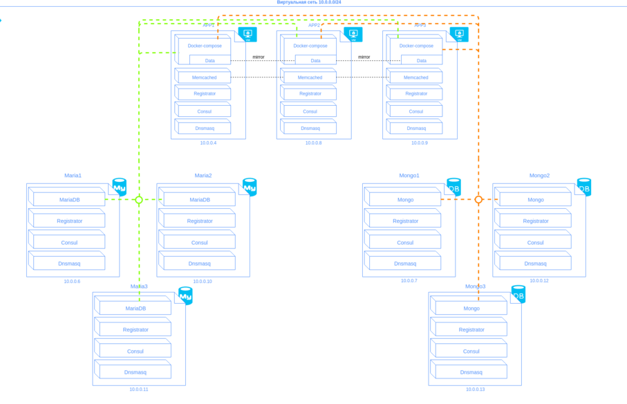

# [WIP] Dockerizing Cruzaria and build virtual private network

How does this look on schema:

## In this tutorial we build only app1 (app2)(app3)

Installation for all other components please search on [Cruzaria](https://github.com/cruzaria/)

## Lauch a production stack
The production stack is sufficient for a minimal production deployment of Open edX.

Prepare build:

    make directories

Build and run:

    docker-compose build # go get a coffee
    docker-compose up

The LMS will be reachable at http://localhost:8000.

The CMS will be reachable at http://localhost:8080.

For local development, you should point to http://localhost:8800.

On the first run you will need to migrate the database and collect static assets:

    make migrate
    make assets

To import the Open edX demo course, cloning from https://github.com/cruzaria/courses to upload dir and run:

    make import-demo-course

To daemonize:

    docker-compose up -d

## Development

Open a bash in the lms:

    docker-compose run lms bash

Open a python shell in the lms or the cms:

    make lms-shell
    make cms-shell

## TODO

- Make sure that secret keys are not shared with the entire world
- Don't duplicate args between containers
- Add arguments to set domain name, platform name, etc.
- Add documentation on host Nginx
- Better readme
